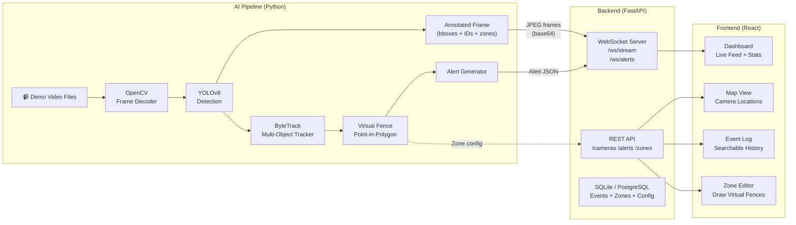

# TerraVision IBVAP — Prototype Implementation Plan

**Goal:** Build a full working demo (pre-recorded video → AI detection/tracking/virtual fencing → real-time dashboard with alerts) in **2–3 days** for SIH 2026 prelims.

**Team:** 4–6 developers · **Hardware:** Laptop with NVIDIA RTX GPU · **Source:** Pre-recorded demo videos

---

## User Review Required

> [!IMPORTANT]
> **Demo Video Strategy:** Since you're using pre-recorded videos (no live RTSP), we'll build the pipeline to process video files via OpenCV and expose results over WebSocket — the dashboard will look identical to a live feed. For the judges, this is indistinguishable from live cameras. You'll need **2–3 demo videos** (daytime outdoor, nighttime, and a checkpoint/gate scene). We can source samples from public surveillance datasets if needed.

> [!WARNING]
> **GPU Requirement:** The AI pipeline (YOLOv8 + ByteTrack) needs ~4 GB VRAM. Confirm your RTX card has at least 4 GB. If multiple cameras are simulated, processing will be sequential (one model instance, rotating feeds) to stay within VRAM budget.

> [!IMPORTANT]
> **Task Delegation:** With 4–6 developers and 2–3 days, I recommend splitting into **3 parallel tracks** (AI Pipeline, Backend API, Frontend Dashboard). The plan below is structured around these tracks with clear interface contracts so teams can work independently.

---

## Open Questions

> [!IMPORTANT]
> 1. **Demo Videos:** Do you have specific demo videos ready, or should we use public datasets (like MOT17, VisDrone, or COCO surveillance clips)?
> 2. **Branding:** Do you have a logo, color scheme, or brand assets for TerraVision, or should we design the dashboard aesthetics from scratch?
> 3. **Map View:** For the GIS map view feature — do you want a real map (MapLibre GL) with pins for simulated BOP locations, or is a static map image sufficient for the demo?
> 4. **Alert Channels:** For the prototype, should alerts only go to the dashboard (WebSocket push), or do you also want SMS/email integration (Twilio/SMTP)?

---

## Architecture Overview (Prototype)



---

## Proposed Changes

### Track 1 — AI Pipeline (Python) · **2 developers** · **Day 1–2**

The core detection, tracking, and virtual fencing engine. Processes video files and pushes annotated frames + alerts to the backend via WebSocket.

---

#### [NEW] `ai_pipeline/requirements.txt`

```
ultralytics>=8.2.0
opencv-python-headless>=4.9.0
numpy>=1.24.0
supervision>=0.21.0  # Roboflow's helper lib for annotations & ByteTrack
shapely>=2.0.0       # Point-in-polygon for virtual fencing
websockets>=12.0
aiohttp>=3.9.0
```

> [!TIP]
> We use the `supervision` library from Roboflow — it wraps ByteTrack, provides beautiful annotation drawing, and cuts ~500 lines of boilerplate code.

---

#### [NEW] `ai_pipeline/detector.py`

**Core detection + tracking engine.**

| Component | Implementation |
|:---|:---|
| **Video Input** | `cv2.VideoCapture` — reads from file path or RTSP URL |
| **Detection** | `ultralytics.YOLO('yolov8m.pt')` — medium model, good balance of speed/accuracy |
| **Tracking** | `supervision.ByteTrack()` — multi-object tracker with ID persistence |
| **Classes** | Filter to persons (class 0) and vehicles (class 2, 3, 5, 7) |
| **Annotation** | `supervision.BoundingBoxAnnotator` + `LabelAnnotator` + `TraceAnnotator` |
| **Output** | Annotated JPEG frame (base64) + detection metadata (JSON) per frame |

Key design:
- Runs at **~15–25 FPS** on RTX GPU (YOLOv8m)
- Outputs both the annotated frame (for dashboard display) and structured detection data (for alerts/analytics)
- Configurable confidence threshold (default 0.4)

---

#### [NEW] `ai_pipeline/virtual_fence.py`

**Virtual fencing logic — purely geometric, no extra AI cost.**

| Feature | Implementation |
|:---|:---|
| **Zone Intrusion** | `shapely.Polygon.contains(Point)` — check if object centroid is inside zone |
| **Tripwire** | `shapely.LineString` — check if object track crosses the line between frames |
| **Directional Tripwire** | Cross-product of movement vector vs line normal — determine crossing direction |
| **Dwell Zone** | Track time-in-zone per object ID; alert if exceeds threshold |

```python
# Pseudocode structure
class VirtualFenceEngine:
    def __init__(self):
        self.zones: List[FenceZone] = []      # Loaded from backend API
        self.dwell_timers: Dict[int, float]    # track_id → time_entered

    def check_detections(self, detections, tracks) -> List[Alert]:
        """Check all tracked objects against all defined zones."""
        alerts = []
        for track in tracks:
            for zone in self.zones:
                if zone.type == "intrusion" and zone.polygon.contains(track.centroid):
                    alerts.append(IntrusionAlert(track, zone))
                elif zone.type == "tripwire" and self._crossed_line(track, zone.line):
                    alerts.append(TripwireAlert(track, zone))
                # ... dwell zone logic
        return alerts
```

---

#### [NEW] `ai_pipeline/stream_manager.py`

**Manages multiple video sources and pushes results to backend.**

- Maintains a registry of "cameras" (video files mapped to camera IDs)
- Processes each camera source in a round-robin or threaded fashion
- Encodes annotated frames as JPEG → base64 and sends via WebSocket to backend
- Sends detection events and alerts as structured JSON

```python
# Data contract — what gets sent to backend per frame
{
    "camera_id": "cam-01",
    "timestamp": "2026-09-12T09:15:30.123Z",
    "frame": "<base64 JPEG>",          # Annotated frame for display
    "detections": [
        {
            "track_id": 42,
            "class": "person",
            "confidence": 0.87,
            "bbox": [120, 340, 280, 640],   # x1, y1, x2, y2
            "centroid": [200, 490]
        }
    ],
    "alerts": [
        {
            "type": "zone_intrusion",
            "severity": "high",
            "zone_name": "Restricted Area Alpha",
            "track_id": 42,
            "thumbnail": "<base64 crop>"
        }
    ],
    "stats": {
        "person_count": 3,
        "vehicle_count": 1,
        "fps": 22.4
    }
}
```

---

#### [NEW] `ai_pipeline/night_enhancer.py`

**Preprocessing for low-light / night footage.**

- CLAHE (Contrast Limited Adaptive Histogram Equalization) for low-light frames
- Auto-detect brightness level and apply enhancement only when needed
- Simple but visually impressive for the demo — before/after is dramatic

---

#### [NEW] `ai_pipeline/main.py`

**Entry point — starts the pipeline, connects to backend.**

```bash
python main.py --config config.yaml
```

Config example:
```yaml
cameras:
  - id: "cam-bop-01"
    name: "BOP Alpha - Gate"
    source: "./demo_videos/daytime_gate.mp4"
    loop: true  # Loop video for continuous demo
  - id: "cam-bop-02"
    name: "BOP Alpha - Perimeter"
    source: "./demo_videos/night_perimeter.mp4"
    loop: true

backend_ws: "ws://localhost:8000/ws/pipeline"
model: "yolov8m.pt"
confidence: 0.4
device: "cuda:0"
```

---

### Track 2 — Backend API (FastAPI + Python) · **1–2 developers** · **Day 1–2**

REST API + WebSocket relay. Receives data from AI pipeline, stores events, serves the frontend.

---

#### [NEW] `backend/requirements.txt`

```
fastapi>=0.111.0
uvicorn[standard]>=0.30.0
websockets>=12.0
sqlalchemy>=2.0.0
pydantic>=2.7.0
python-multipart>=0.0.9
aiosqlite>=0.20.0   # Async SQLite for prototype speed
```

---

#### [NEW] `backend/main.py`

FastAPI application entry point.

```
POST   /api/cameras                    # Register a camera source
GET    /api/cameras                    # List all cameras with status
GET    /api/cameras/{id}/snapshot      # Latest frame from a camera

POST   /api/zones                      # Create a virtual fence zone
GET    /api/zones                      # List all zones
GET    /api/zones?camera_id=cam-01     # Zones for a specific camera
PUT    /api/zones/{id}                 # Update zone geometry
DELETE /api/zones/{id}                 # Remove a zone

GET    /api/alerts                     # List alerts (paginated, filterable)
GET    /api/alerts/{id}                # Alert detail with thumbnail
PUT    /api/alerts/{id}/acknowledge    # Mark alert as acknowledged
GET    /api/alerts/stats               # Alert counts by type/severity/time

GET    /api/analytics/dashboard        # Live stats (person count, vehicle count, active alerts)

WS     /ws/stream/{camera_id}          # Live annotated video stream (base64 frames)
WS     /ws/alerts                      # Real-time alert push to dashboard
WS     /ws/pipeline                    # Receives data from AI pipeline (internal)
```

---

#### [NEW] `backend/models.py`

SQLAlchemy models:

| Model | Key Fields |
|:---|:---|
| **Camera** | `id`, `name`, `location`, `status` (online/offline), `source_url`, `last_frame_at` |
| **FenceZone** | `id`, `camera_id`, `name`, `type` (intrusion/tripwire/dwell), `geometry` (JSON polygon), `severity`, `enabled` |
| **Alert** | `id`, `camera_id`, `zone_id`, `type`, `severity`, `track_id`, `thumbnail` (base64), `acknowledged`, `created_at` |
| **DetectionEvent** | `id`, `camera_id`, `track_id`, `class_name`, `confidence`, `bbox`, `timestamp` |

---

#### [NEW] `backend/ws_manager.py`

WebSocket connection manager — the relay between AI pipeline and frontend dashboards.

```
AI Pipeline ──(ws)──► Backend WS Manager ──(ws)──► Frontend Dashboards
                              │
                              ▼
                      SQLite (persist alerts/events)
```

- Receives frames + detections from pipeline via `/ws/pipeline`
- Broadcasts annotated frames to all connected dashboard clients via `/ws/stream/{camera_id}`
- Broadcasts alerts to all connected clients via `/ws/alerts`
- Persists alerts and detection events to database

---

### Track 3 — Frontend Dashboard (React) · **2 developers** · **Day 1–3**

The showpiece for judges. Must look **premium, professional, and militaristic/tactical.**

---

#### [NEW] `frontend/` — React application (Vite)

```
frontend/
├── src/
│   ├── components/
│   │   ├── layout/
│   │   │   ├── Sidebar.tsx          # Navigation sidebar
│   │   │   ├── Header.tsx           # Top bar with alerts badge
│   │   │   └── Layout.tsx           # Main layout wrapper
│   │   ├── dashboard/
│   │   │   ├── LiveFeedGrid.tsx     # Multi-camera live view (2x2 grid)
│   │   │   ├── CameraFeed.tsx       # Single camera stream (WebSocket → canvas)
│   │   │   ├── StatsPanel.tsx       # Real-time counters (persons, vehicles, alerts)
│   │   │   ├── AlertTicker.tsx      # Scrolling alert bar at bottom
│   │   │   └── ActivityChart.tsx    # Detection activity over time (Chart.js)
│   │   ├── alerts/
│   │   │   ├── AlertList.tsx        # Filterable, searchable alert history
│   │   │   ├── AlertCard.tsx        # Individual alert with thumbnail + details
│   │   │   └── AlertDetail.tsx      # Full alert view with evidence
│   │   ├── zones/
│   │   │   ├── ZoneEditor.tsx       # Draw zones on camera feed (canvas overlay)
│   │   │   ├── ZoneList.tsx         # Manage existing zones
│   │   │   └── ZoneDrawCanvas.tsx   # Polygon drawing tool
│   │   └── map/
│   │       └── MapView.tsx          # GIS view with camera pins (MapLibre GL)
│   ├── hooks/
│   │   ├── useWebSocket.ts          # WebSocket connection hook
│   │   ├── useAlerts.ts             # Alert state management
│   │   └── useCameraStream.ts       # Camera feed stream hook
│   ├── pages/
│   │   ├── DashboardPage.tsx        # Main surveillance dashboard
│   │   ├── AlertsPage.tsx           # Alert history & management
│   │   ├── ZonesPage.tsx            # Virtual fence configuration
│   │   └── MapPage.tsx              # Geographic overview
│   ├── styles/
│   │   └── index.css                # Global styles — tactical dark theme
│   ├── App.tsx                      # Router + layout
│   └── main.tsx                     # Entry point
```

---

#### Dashboard Design — Tactical Dark Theme

The dashboard should feel like a **military command center**. Key design principles:

| Element | Design |
|:---|:---|
| **Color Scheme** | Deep navy/charcoal background (`#0a0f1c`, `#111827`), electric cyan accents (`#06d6a0`, `#00f5d4`), red for alerts (`#ef4444`) |
| **Typography** | `JetBrains Mono` for data/counters, `Inter` for UI text — feels technical and precise |
| **Cards/Panels** | Glassmorphism with subtle backdrop-blur, thin cyan border glow |
| **Animations** | Pulsing red dot for active alerts, smooth counter transitions, slide-in alert notifications |
| **Camera Feeds** | Rounded corners, subtle scan-line overlay effect, green "LIVE" indicator badge |
| **Stats** | Large animated counters with icon badges, trend arrows |

---

#### Key Frontend Components — Detail

**`LiveFeedGrid.tsx`** — The centerpiece
- 2×2 grid showing all camera feeds simultaneously
- Each cell renders `<canvas>` element receiving base64 frames via WebSocket
- Overlay shows: camera name, FPS, detection count, recording indicator
- Click a cell to go full-screen for that camera
- Virtual fence zones drawn as semi-transparent overlays on the canvas

**`ZoneEditor.tsx`** — Interactive zone drawing
- Canvas overlay on top of camera feed
- Drawing modes: polygon (click points), line (tripwire), rectangle (quick zone)
- Real-time preview with color coding (red = intrusion, yellow = tripwire, blue = dwell)
- Save sends polygon coordinates to backend API
- This is the **"wow" feature** for judges — drawing a zone and immediately seeing it trigger alerts

**`AlertTicker.tsx`** — Real-time alert bar
- Horizontal scrolling bar at bottom of dashboard
- New alerts slide in from right with sound effect
- Color-coded by severity (red = high, amber = medium, green = info)
- Click to expand alert detail with thumbnail

**`MapView.tsx`** — Geographic overview
- MapLibre GL map centered on a demo border area
- Camera pins with status indicators (green = online, red = alert active)
- Click pin to see camera details and latest snapshot
- For prototype: use a section of Indo-Nepal or Indo-Bangladesh border

---

## Project Structure (Final)

```
terravision-ibvap/
├── ai_pipeline/
│   ├── main.py                # Entry point
│   ├── detector.py            # YOLOv8 + ByteTrack
│   ├── virtual_fence.py       # Zone intrusion logic
│   ├── stream_manager.py      # Multi-camera management
│   ├── night_enhancer.py      # Low-light preprocessing
│   ├── config.yaml            # Camera sources config
│   └── requirements.txt
├── backend/
│   ├── main.py                # FastAPI app
│   ├── models.py              # SQLAlchemy models
│   ├── schemas.py             # Pydantic schemas
│   ├── ws_manager.py          # WebSocket relay
│   ├── routers/
│   │   ├── cameras.py
│   │   ├── alerts.py
│   │   └── zones.py
│   └── requirements.txt
├── frontend/
│   ├── src/                   # React app (see tree above)
│   ├── package.json
│   └── vite.config.ts
├── demo_videos/               # Pre-recorded demo footage
│   ├── daytime_gate.mp4
│   ├── night_perimeter.mp4
│   └── checkpoint.mp4
├── docker-compose.yml         # One-command startup
└── README.md
```

---

## Development Timeline — 3 Day Sprint

### Day 1 — Foundation (All tracks in parallel)

| Track | Tasks | Owner |
|:---|:---|:---|
| **AI Pipeline** | Set up YOLOv8 + ByteTrack on demo video. Get detections + tracking working. Output annotated frames. Test on GPU — verify FPS. | Dev 1 + Dev 2 |
| **Backend** | FastAPI scaffold. SQLite models. REST endpoints for cameras, zones, alerts. WebSocket server skeleton (`/ws/stream`, `/ws/alerts`, `/ws/pipeline`). | Dev 3 |
| **Frontend** | Vite + React scaffold. Design system (colors, fonts, CSS tokens). Layout shell (sidebar, header). `LiveFeedGrid` with placeholder frames. Dark tactical theme. | Dev 4 + Dev 5 |

**Day 1 Milestone:** AI pipeline detects & tracks persons/vehicles on demo video. Backend API is running. Frontend shows the layout shell with dark theme.

---

### Day 2 — Integration + Virtual Fencing

| Track | Tasks | Owner |
|:---|:---|:---|
| **AI Pipeline** | Implement `virtual_fence.py` (zone intrusion + tripwire). Connect pipeline to backend via WebSocket. Push annotated frames + alerts. Add night enhancement. | Dev 1 + Dev 2 |
| **Backend** | Wire WebSocket relay (pipeline → dashboard). Implement zone CRUD API. Persist alerts to DB. Alert stats endpoint. | Dev 3 |
| **Frontend** | `CameraFeed` component — render WebSocket frames on canvas. `StatsPanel` with live counters. `AlertTicker` with real-time notifications. `ZoneEditor` — draw polygons on camera feed. | Dev 4 + Dev 5 |

**Day 2 Milestone:** End-to-end flow working — video processes through AI, results appear on dashboard in real-time. Virtual fence zones can be drawn on the dashboard and trigger alerts.

---

### Day 3 — Polish + Demo Prep

| Track | Tasks | Owner |
|:---|:---|:---|
| **AI Pipeline** | Tune confidence thresholds. Optimize FPS. Handle edge cases (no detections, lost tracks). Loop demo videos seamlessly. | Dev 1 |
| **Backend** | Performance optimization. Error handling. Add alert acknowledgment. | Dev 2 |
| **Frontend** | `MapView` with camera pins. `AlertsPage` with history. Animations & micro-interactions. Sound effects for alerts. Responsive polish. Loading states. | Dev 3 + Dev 4 |
| **Demo Prep** | Docker Compose for one-command startup. Demo script/walkthrough. Test full flow end-to-end 5+ times. Prepare backup (pre-recorded screen capture). | Dev 5 + Dev 6 |

**Day 3 Milestone:** Polished, demo-ready prototype. One-command startup. Impressive visual demo with live virtual fencing.

---

## Verification Plan

### Automated Tests

```bash
# AI Pipeline — verify detection works on demo video
cd ai_pipeline && python -m pytest tests/ -v

# Backend — API endpoint tests
cd backend && python -m pytest tests/ -v

# Frontend — build verification
cd frontend && npm run build
```

### Manual Verification

| Check | Expected Result |
|:---|:---|
| Start pipeline with demo video | Annotated frames generated at >15 FPS, persons/vehicles detected with bounding boxes and track IDs |
| Open dashboard in browser | 2×2 camera grid showing live annotated feeds, stats panel updating in real-time |
| Draw a virtual fence zone on camera feed | Zone appears as colored polygon overlay. When a person walks into the zone, alert fires immediately on the dashboard |
| Check alerts page | All triggered alerts listed with thumbnails, timestamps, and zone names. Alerts can be acknowledged |
| Open map view | Map shows camera pins at configured locations with status indicators |
| Run for 10+ minutes continuously | No crashes, no memory leaks, stable FPS, WebSocket connections stay alive |
| **Demo rehearsal** | Full walkthrough takes < 5 minutes. All features demonstrate smoothly |

### Demo Script (Suggested)

1. **Open dashboard** — show the tactical command center interface
2. **Point to live feeds** — "These are feeds from two simulated Border Out Posts"
3. **Highlight detection** — "YOLOv8 is detecting and tracking every person and vehicle in real-time on our GPU"
4. **Draw a virtual fence** — Live on-stage: draw a zone on the camera feed → person walks into zone → alert fires instantly
5. **Show alerts** — "Every event is logged with evidence thumbnails for forensic review"
6. **Show map** — "Command center sees all cameras across all BOPs on a geographic map"
7. **Explain architecture** — "All AI runs at the edge — only metadata travels over the network"

---

## Risk Mitigation

| Risk | Mitigation |
|:---|:---|
| **GPU issues on demo day** | Have a fallback: pre-recorded screen capture of the full demo flow |
| **WebSocket drops** | Auto-reconnect logic in frontend + backend. Show "Reconnecting..." indicator instead of crash |
| **Low FPS on demo laptop** | Use YOLOv8s (small) instead of YOLOv8m. Reduce input resolution to 640×480 |
| **Demo video too short** | Loop videos seamlessly with `cv2.VideoCapture` reset |
| **No internet at venue** | Everything runs locally — no cloud dependencies. Bundle all models and assets |
