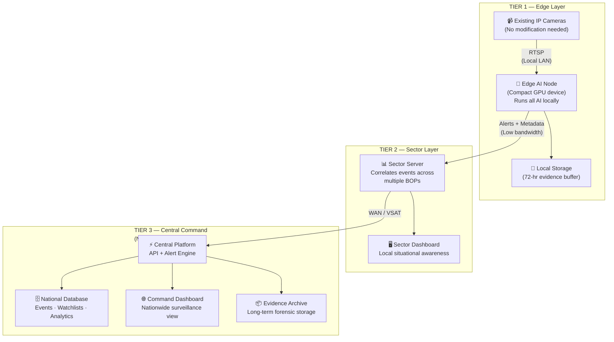
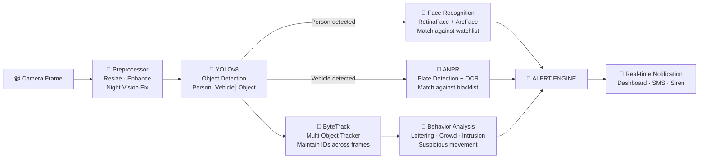
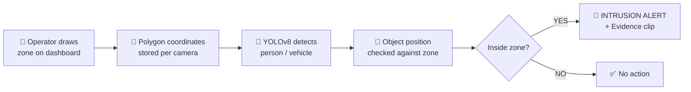
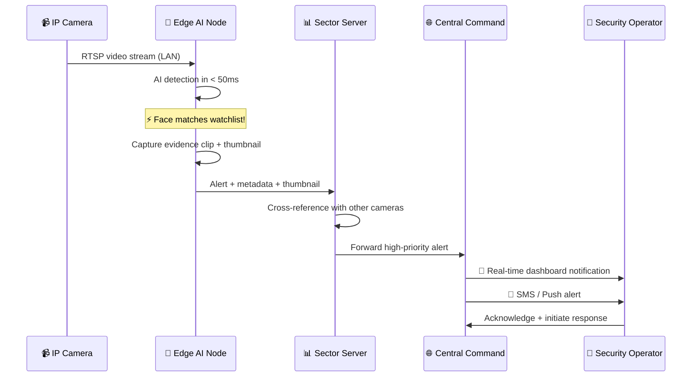
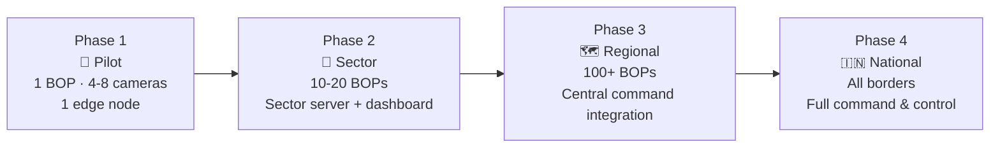

# TerraVision IBVAP — System Architecture Overview

**SIH 2026 · Problem Statement #26187**
**Organization:** Ministry of Home Affairs — Sashastra Seema Bal (SSB)
**Theme:** Blockchain & Cybersecurity · **Category:** Software

---

## The Problem

BSF/SSB deploys **thousands of CCTV cameras** at Border Out Posts, check posts, and strategic locations — but today's systems are **passive recorders** that require 24/7 human monitoring. Intelligent capabilities (facial recognition, ANPR, intrusion detection) need **expensive proprietary hardware** that's impractical for remote border areas.

**Result:** Cameras exist, intelligence doesn't.

## Our Solution — TerraVision IBVAP

> A **software-only AI platform** that transforms existing CCTV cameras into an intelligent surveillance network — **no new hardware at the camera end.**

Drop-in software that plugs into any standard IP camera's RTSP feed and delivers real-time:
- 🧍 Human detection & tracking
- 🚗 Vehicle detection & classification
- 👤 Facial recognition against watchlists
- 🔢 Automatic Number Plate Recognition (ANPR)
- 🚧 Virtual fence / intrusion detection
- ⚠️ Suspicious behavior detection
- 🌙 Night-time movement detection
- 🔔 Instant alerts to command centers

---

## High-Level System Architecture

Three tiers — designed for the reality of border deployments: **low bandwidth, harsh conditions, mission-critical uptime.**

> [!IMPORTANT]
> **Key Design Principle:** Only **metadata and short evidence clips** travel over the WAN — never raw video. This makes the system viable even over satellite links in remote border areas.

### Why 3 Tiers?

| Challenge at the Border | How Our Architecture Solves It |
|:---|:---|
| **Poor / no internet** | Edge nodes run AI **fully offline** — alerts queue and sync when connectivity returns |
| **Low bandwidth** | Only metadata (~1 KB per event) + short clips travel upstream, not continuous video |
| **Latency kills** | Threats detected **in milliseconds** at the edge, not seconds via cloud round-trip |
| **Scale** | Add new BOPs by deploying another edge node — the rest of the system doesn't change |
| **Reliability** | Each tier operates independently — if the central server goes down, BOPs keep working |

---

## AI Pipeline — How Intelligence Is Extracted

Every frame from every camera goes through this pipeline **on the edge node itself:**

### Model Choices & Rationale

| Capability | Model | Why This Model |
|:---|:---|:---|
| **Object Detection** | YOLOv8 (Ultralytics) | Industry-leading speed vs. accuracy; runs on edge GPUs in real-time |
| **Object Tracking** | ByteTrack | Maintains person/vehicle identity across frames — enables behavior analysis |
| **Face Detection** | RetinaFace | Works at angles and distances; handles small faces in surveillance footage |
| **Face Encoding** | ArcFace | State-of-art face embeddings; 99.8% accuracy on benchmarks |
| **Face Matching** | FAISS (Vector Search) | Sub-millisecond search across thousands of watchlist entries |
| **Plate Detection** | YOLOv8 (fine-tuned) | Custom-trained on Indian license plate formats |
| **Plate OCR** | PaddleOCR | Best multilingual OCR; handles Hindi + English plates |
| **Night Enhancement** | CLAHE + IR-aware processing | Improves detection in low-light and infrared camera feeds |
| **Inference Acceleration** | TensorRT / ONNX Runtime | 3-5× speed boost on NVIDIA GPUs |

---

## Core Features & Priority

| # | Feature | What It Does | Alert |
|:---|:---|:---|:---|
| 1 | **Human Detection & Tracking** | Detect and follow people across frames with unique IDs | Log |
| 2 | **Vehicle Detection & Classification** | Identify cars, trucks, bikes — classify type | Log |
| 3 | **Facial Recognition (FRS)** | Match detected faces against a known watchlist | 🔴 Real-time |
| 4 | **ANPR** | Read license plates, cross-check against blacklist | 🔴 Real-time |
| 5 | **Virtual Fence** | Draw zones on camera view — alert on any crossing | 🔴 Real-time |
| 6 | **Suspicious Activity** | Loitering, unusual paths, crowd formation | 🟡 Warning |
| 7 | **Night-time Detection** | Enhanced AI for low-light / IR feeds | 🟡 Warning |
| 8 | **Real-time Alerts** | Instant push to dashboard, SMS, and command chain | — |
| 9 | **Event Logging & Forensics** | Searchable history of all events with evidence clips | — |
| 10 | **GIS Map View** | All cameras on a geographic map with live status | — |

---

## Virtual Fencing — Deep Dive

One of IBVAP's most powerful and **visually impressive** capabilities. Operators define restricted zones directly on the camera feed — **no physical fencing or sensors needed.**

### How It Works

> [!NOTE]
> **Zero additional AI cost** — virtual fencing is a geometric calculation (point-in-polygon test) that runs on top of YOLO detections already happening. No extra model needed.

### Types of Virtual Fences

| Type | How It Works | Border Use Case |
|:---|:---|:---|
| **🟥 Zone Intrusion** | Alert when any person/vehicle enters a defined polygon area | Restricted zones near border fence, military installations |
| **➖ Tripwire** | Alert when an object crosses a defined line | Border fence line — detect crossings |
| **➡️ Directional Tripwire** | Alert only when crossing a line in a **specific direction** | Check post wrong-way entry; detect inbound vs. outbound |
| **⏱️ Dwell Zone** | Alert when someone **stays** inside a zone longer than N seconds | Loitering near sensitive areas, suspicious parking |

### Why This Matters for SSB

- **Configurable per camera** — operators draw zones from the dashboard, no retraining or redeployment
- **Multiple zones per camera** — define different sensitivity areas (high-alert near fence, monitoring zone further out)
- **Works day and night** — uses the same YOLO detections that already handle night-enhanced frames
- **Instant response** — alert fires within milliseconds of zone violation, not minutes of human review

---

## Tech Stack Summary

| Layer | Technologies |
|:---|:---|
| **AI / Computer Vision** | Python · PyTorch · Ultralytics YOLOv8 · OpenCV · InsightFace · PaddleOCR · FAISS |
| **Backend API** | FastAPI (Python) · PostgreSQL · Redis · Celery |
| **Frontend Dashboard** | React · MapLibre GL (maps) · WebSocket (live alerts) · Chart.js |
| **Edge Deployment** | NVIDIA Jetson (Orin) · TensorRT · Docker |
| **Infrastructure** | Docker Compose · Nginx · MinIO (evidence storage) |

> [!NOTE]
> **100% open-source stack** — no vendor lock-in, no licensing costs. Aligned with government preference for open-source and cost-effectiveness.

---

## Data Flow — An Alert's Lifecycle

---

## Innovation Highlights — What Sets IBVAP Apart

### 1. Software-Only Transformation
> Converts **any existing IP camera** into a smart surveillance node. Zero hardware changes at camera end. Massive cost savings over proprietary smart-camera solutions.

### 2. Edge-First Architecture
> AI runs **at the border, not in a data center**. Works fully offline. Detects threats in **milliseconds**, not seconds. Only metadata travels over the network.

### 3. Unified Multi-Model Pipeline
> One platform handles **FRS + ANPR + Intrusion + Behavior** — instead of buying 4 separate products from 4 vendors.

### 4. Bandwidth-Aware Design
> Designed for **satellite links and poor connectivity** — typical at remote border posts. Sends ~1 KB metadata per event, not continuous video streams.

### 5. Cost Effectiveness

| Approach | Cost per Camera (Approx.) |
|:---|:---|
| Proprietary FRS Camera | ₹2-5 Lakh per unit |
| Proprietary ANPR Camera | ₹3-8 Lakh per unit |
| **IBVAP (software on existing camera)** | **₹0 per camera** (edge node shared across 4-8 cameras) |

---

## Security & Compliance

| Aspect | Approach |
|:---|:---|
| **Data Sovereignty** | All processing and storage on government infrastructure — no public cloud |
| **Encryption** | TLS 1.3 in transit · AES-256 at rest |
| **Access Control** | Role-based (Admin / Sector Commander / Operator) with JWT authentication |
| **Audit Trail** | Every action logged — who accessed what, when, from where |
| **Network Isolation** | Camera network on isolated VLAN; no direct internet access |
| **Model Integrity** | Signed AI model files with hash verification before loading |

---

## Scalability Path

---

## Suggested Presentation Structure

> [!TIP]
> Use this as your slide outline for the prelims presentation.

| Slide # | Title | Content | Time |
|:---|:---|:---|:---|
| 1 | **Title Slide** | TerraVision IBVAP · Team Name · PS #26187 | 30s |
| 2 | **The Problem** | Passive CCTVs · Human monitoring burden · Expensive hardware | 1 min |
| 3 | **Our Solution** | Software-only AI platform · One-line value prop | 1 min |
| 4 | **System Architecture** | 3-tier diagram (Edge → Sector → Command) | 2 min |
| 5 | **AI Pipeline** | Detection → Recognition → Tracking → Behavior → Alert | 2 min |
| 6 | **Key Features** | Feature matrix with demo screenshots/mockups | 2 min |
| 7 | **Innovation & USPs** | Software-only · Edge-first · Bandwidth-aware · Cost comparison | 1.5 min |
| 8 | **Tech Stack** | Single table · "100% open-source" highlight | 30s |
| 9 | **Security & Compliance** | Data sovereignty · Encryption · Audit trail | 30s |
| 10 | **Feasibility & Roadmap** | Pilot → Sector → Regional → National | 1 min |
| 11 | **Thank You / Q&A** | Team members · Contact | — |

---

## Potential Judge Questions & Answers

| Question | Answer |
|:---|:---|
| *"How is this different from existing solutions?"* | Existing solutions need proprietary cameras (₹2-8L each). We work with **any existing IP camera** — pure software, zero hardware cost at camera end. |
| *"Can it work without internet?"* | Yes. The edge node runs AI **completely offline**. Alerts queue locally and sync when connectivity returns. |
| *"What about false positives?"* | We use multi-frame confirmation (track for N frames before alerting) + confidence thresholds. Operators can tune sensitivity per zone. |
| *"How do you handle night/low-light?"* | CLAHE preprocessing for low-light cameras + IR-aware pipeline for infrared feeds. YOLOv8 is also trained on night-time datasets. |
| *"What about privacy / data security?"* | All data stays on government infrastructure. AES-256 encryption, role-based access, complete audit trail. No public cloud dependency. |
| *"What hardware do you need at the edge?"* | An NVIDIA Jetson Orin Nano (~₹25K) can handle 4-8 cameras. It's the size of a credit card. |
| *"How does virtual fencing work without physical infrastructure?"* | Operators draw zones directly on the camera view in our dashboard. The AI checks every detected person/vehicle against these zones using geometric intersection — pure software, no sensors or physical barriers needed. Zones are reconfigurable in seconds. |
